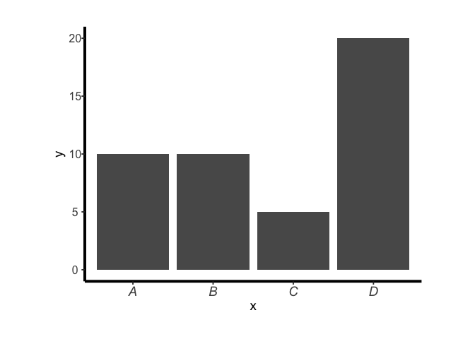

<!-- README.md is generated from README.Rmd. Please edit that file -->

# plotthemes

<!-- badges: start -->

<!-- badges: end -->

The goal of plotthemes is to provide some extra plotting themes for ease
of use with ggplot2. Primarily aimed at personal use.

## Installation

And the development version from [GitHub](https://github.com/) with:

``` r
# install.packages("devtools")
devtools::install_github("ogsteele/plotthemes")
```

## Example

``` r
# this is an example of `theme_test_OGS()`
library(ggplot2)
library(plotthemes)
y <- c(10,10,5,20)
x <- c("A","B","C","D")
dat = data.frame(x,y)
plot = ggplot2::ggplot(dat, ggplot2::aes(x,y)) +
    ggplot2::geom_col() +
    theme_test_OGS()
plot
```



<!-- 
You'll still need to render `README.Rmd` regularly, to keep `README.md` up-to-date. `devtools::build_readme()` is handy for this. You could also use GitHub Actions to re-render `README.Rmd` every time you push. An example workflow can be found here: <https://github.com/r-lib/actions/tree/master/examples>.
-->
